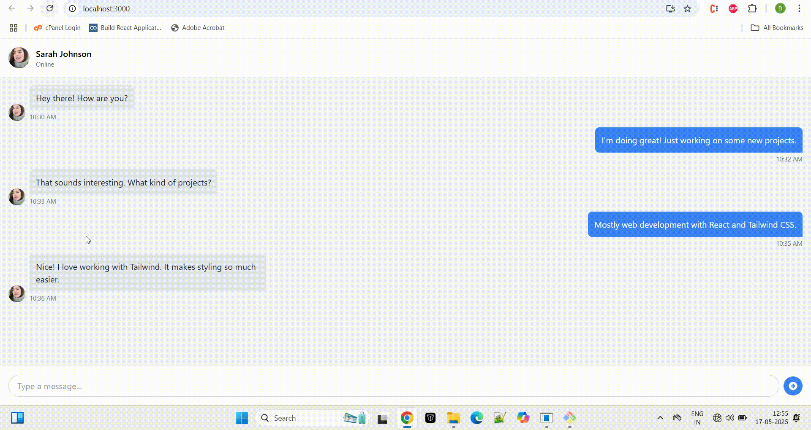

#  Tailwind CSS Creative UI Components

This repository demonstrates beautiful, responsive, and modern UI components built using **[Tailwind CSS](https://tailwindcss.com/)**. These examples are designed to showcase advanced Tailwind usage with real-world inspiration and aesthetic polish.

## Features

Utility-First: Build any design directly in your markup with utility classes

Responsive Design: Easily build responsive interfaces with responsive variants

Customizable: Configure your design system in the tailwind.config.js file

Dark Mode: First-class dark mode support

Just-in-Time (JIT): On-demand CSS generation for faster development

PurgeCSS: Remove unused CSS in production for optimal file sizes

#  Installation

### `Using npm`

npm install -D tailwindcss postcss autoprefixer

npx tailwindcss init

### `Configuration`

### `Create a tailwind.config.js file`

 module.exports = {
  content: [
    "./src/**/*.{html,js,ts,jsx,tsx}",
    "./public/index.html"
  ],
  theme: {
    extend: {},
  },
  plugins: [],
}

### `Add Tailwind to your CSS`

@tailwind base;
@tailwind components;
@tailwind utilities;

### `Usage`
 'Basic Example'

<button class="bg-blue-500 hover:bg-blue-700 text-white font-bold py-2 px-4 rounded">
  Click me
</button>

### `Build Process`

## Development

npx tailwindcss -i ./src/input.css -o ./dist/output.css --watch

### `how to run` 
npm start

# Examples

## 1.Responsive Dashboard

A clean, grid-based dashboard layout featuring a sidebar, top navigation, and stat cards.
### ✅ Features
- Responsive grid using Tailwind's `grid-cols` and breakpoints

- Sidebar with vertical navigation

- Cards with hover effects

## 2.Glassmorphism Login Form

A modern frosted glass effect login form with smooth blur and transparency.

 ### ✅ Features

-backdrop-blur for glass effect

-Centered layout

-Transparent background with rounded corners

## 3.Instagram-like Image Hover

A sleek image grid with hover overlays that mimic Instagram post previews.
 
  ### ✅ Features

-Hover overlay with icons

-Image grid with gap and responsive support

-Uses group and group-hover

## 4. Chat UI Design

A simple, responsive chat interface with messages, avatars, and timestamps.

 ### ✅ Features

 -Message bubbles aligned left/right

-Flex layout for avatars and text

-Scrollable chat area

